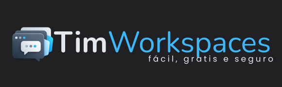
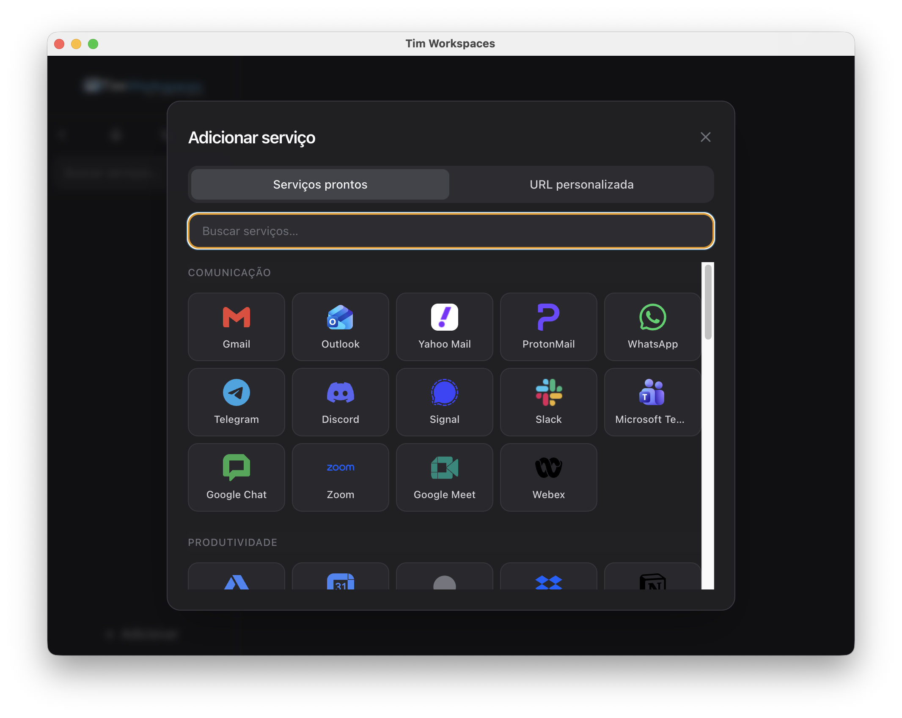

<p align="center">
  
</p>

<h1 align="center">Tim Workspaces</h1>

<p align="center">
  <strong>Um só lugar para WhatsApp Web, Gmail, Teams, Slack e o que mais você usa no browser.</strong>
</p>

<p align="center">
  <a href="https://timworkspaces.com/">Site</a>
  ·
  <a href="https://github.com/renatoruis/timworkspaces/releases">Downloads</a>
  ·
  <a href="https://github.com/renatoruis/timworkspaces/issues">Issues</a>
</p>

<p align="center">
  <a href="https://github.com/renatoruis/timworkspaces/actions/workflows/release.yml"></a>
  <a href="https://github.com/renatoruis/timworkspaces/releases/latest"></a>
  <a href="https://github.com/renatoruis/timworkspaces/releases"></a>
  <a href="LICENSE"></a>
  <a href="https://github.com/renatoruis/timworkspaces/stargazers"></a>
  <br>
  <a href="https://github.com/renatoruis/timworkspaces"></a>
  <a href="https://www.electronjs.org/"></a>
  <a href="https://pnpm.io/"></a>
</p>

---

## Screenshot



## Funcionalidades

| | |
| --- | --- |
| **Várias ferramentas** | WhatsApp, Gmail, Teams, Slack e outras em abas |
| **Sessões separadas** | Cada serviço com sua própria sessão (várias contas, etc.) |
| **Uma janela** | Menos alt-tab entre apps de browser |
| **Tema claro / escuro** | Ajuste rápido na interface do app |
| **Desktop** | Windows, macOS e Linux (builds na [aba Releases](https://github.com/renatoruis/timworkspaces/releases)) |

## Instalação para desenvolver

```bash
git clone https://github.com/renatoruis/timworkspaces.git
cd timworkspaces
pnpm install
pnpm run start
```

Use **pnpm** (recomendado). Com npm: `npm install` e `npm run start`.

## Download (binários)

Instaladores prontos: **[GitHub Releases](https://github.com/renatoruis/timworkspaces/releases/latest)** (`.exe`, `.dmg`, `.deb`).

Cada push na branch `main` que altera código dispara o workflow **Build and Release**, que gera artefatos e publica/atualiza a release da versão em `package.json`.

### Windows

Baixe o `.exe`. Se o SmartScreen avisar: **Mais informações** → **Executar assim mesmo**. O instalador pode não estar assinado com certificado pago; o código-fonte é público.

### macOS

Use o `.dmg` correto (**arm64** Apple Silicon ou **x64** Intel). Arraste para **Aplicativos**. Na primeira abertura, se aparecer aviso de app não assinado: clique com o botão direito → **Abrir**, ou:

```bash
xattr -cr /Applications/Tim\ Workspaces.app
```

**Gravação de tela** (compartilhar tela em Meet/Teams, etc.): em **Ajustes do sistema** → **Privacidade e segurança** → **Gravação de tela**, permita o Tim Workspaces.

### Linux

Instale o `.deb` (Ubuntu/Debian) ou use `dpkg -i` / gerenciador de pacotes.

## Resolução de problemas

### Microsoft Teams pede passkey e não avança

O login Microsoft pode mostrar *Face, fingerprint, PIN or security key* e ficar preso — o Electron não completa WebAuthn da mesma forma que o Safari ou o Chrome.

**Na v1.5.4+:** a app bloqueia passkey nas páginas de login Microsoft (incluindo iframes e popups OAuth) e oferece palavra-passe, Authenticator ou o botão **Abrir no navegador** no topo da janela de login.

**Se ainda tiveres problemas:**

1. Na janela de login, procura **Sign in another way** / **Outras formas de iniciar sessão**.
2. Usa o botão **Abrir no navegador**, conclui o login no Safari/Chrome e volta à app.
3. Passkeys nativos (Touch ID) no macOS exigem build especial com provisioning profile Apple — não estão activos no instalador padrão.

### CI macOS falha com HTTP 403 na notarização

Mensagem *A required agreement is missing or has expired* → entra em [developer.apple.com/account](https://developer.apple.com/account), secção **Agreements**, e assina os acordos pendentes. Depois define a variável de repositório `ENABLE_MAC_NOTARIZE=true` e re-executa o workflow. Sem notarização (variável ausente ou `false`), o `.dmg` é assinado mas o macOS pode pedir confirmação extra na primeira abertura.

## Changelog recente

### v1.5.4

- **Fix Teams / Microsoft (reforço):** bloqueio WebAuthn em todos os frames (iframes de login), popups OAuth com preload, e fallback `NotSupportedError` para forçar palavra-passe ou Authenticator.

### v1.5.3

- **Fix Teams / Microsoft:** bloqueia WebAuthn/passkey nas páginas de login Microsoft para forçar palavra-passe ou Authenticator; banner **Abrir no navegador** na janela de auth; User-Agent Chrome na janela de login.

### v1.5.2

- Download directo do instalador no modal de atualização; fix atalhos Cmd+1–9; polish tema claro, zoom e atalhos no menu.
- Links `target=_blank` abrem no browser externo (fix popups que quebravam a app).

### v1.5.1

- **Fix macOS:** remove `keychain-access-groups` do build padrão — a v1.5.0 não abria (“app não pode ser aberto”) sem provisioning profile Apple.

### v1.5.0

- Electron 42; login **Microsoft** em janela dedicada (como Google); popups de auth na mesma sessão.
- Build **macOS assinado e notarizado** via CI (`ENABLE_MAC_SIGNING`). Passkeys Touch ID requerem build especial (não incluído por defeito).

### v1.4.1

- Link **Dar estrelinha no GitHub** abre o repositório direto no navegador.
- Ícone do **tray no macOS** redimensionado (18×18) em vez do PNG 512×512.

### v1.3.3

- Permissões de **webview** alinhadas entre *request* e *check* (menos loops pedindo notificação ou permissão de tela).
- Suporte a **compartilhamento de tela** via `setDisplayMediaRequestHandler` (seletor nativo no macOS quando disponível + fallback com `desktopCapturer`).
- **macOS:** `NSScreenCaptureUsageDescription` para o prompt de captura de tela do sistema.

## Tecnologias

- [Electron](https://www.electronjs.org/) — shell desktop
- JavaScript, HTML, CSS ([Tailwind](https://tailwindcss.com/) no build)

## Site e documentação

- Site público: **[timworkspaces.com](https://timworkspaces.com/)** (GitHub Pages a partir da pasta `website/`).
- Assinatura e notarização **macOS** (opcional, conta Apple Developer): configure secrets no repositório e a variável `ENABLE_MAC_SIGNING` conforme o workflow em `.github/workflows/release.yml`.

## Contribuir

- [Issues](https://github.com/renatoruis/timworkspaces/issues) — bugs e ideias  
- [Pull requests](https://github.com/renatoruis/timworkspaces/pulls) — correções e melhorias  

Tim Workspaces é **gratuito e sempre será** — feito com a colaboração da comunidade.

## Licença

[Creative Commons Attribution-NonCommercial 4.0 (CC BY-NC 4.0)](LICENSE) — uso e modificação permitidos; **uso comercial** (incluindo venda) não permitido.
